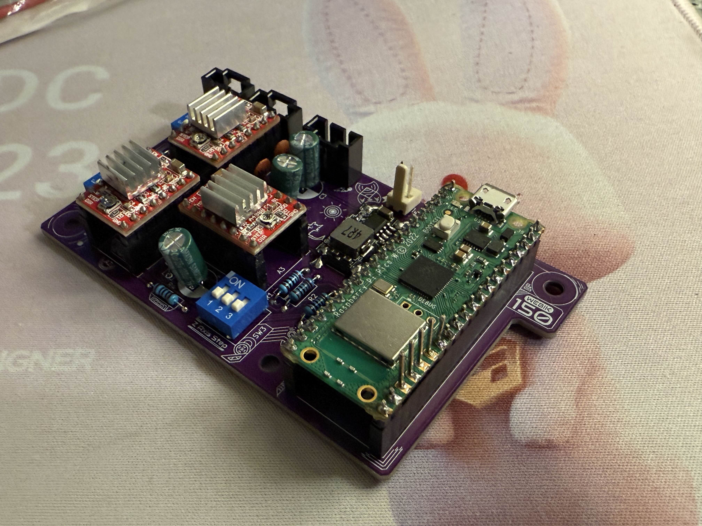

# RaPiPiMiSt
-# Raspberry Pi Pico Microphone Stand

This project aims to create a motorized microphone stand using old NEMA-17 stepper motors from Prusa MK3, controllable through a LAN web server hosted on a RPi Pico W using MicroPython.

The software part operates in two modes:

- **Pairing Mode**: When no Wi-Fi credentials are available at startup, or wi-fi connection is unsuccessful, the device creates a Wi-Fi Access Point (AP) and serves as a captive portal to allow users to configure the Wi-Fi settings. It is also possible to control the stand in this way in case you need to record in the field without any wifi for whatever reason.
- **Work Mode**: Once Wi-Fi credentials are saved, the device connects to the saved network and serves a control website on the local network.


### Updates
- **2024-11-02**: PCB was tested out to be working so I added files for it along with pics. Feel free to have it made, I usually use JLCPCB for that. I also added an 8SEG display to the thing last minute, which means there's no connector for it on the PCB, however you can just solder 4 pins to the top of the Pico like in the pic below.

## Features
- Movement on X and Y axes (Forward/Back and Left/Right)
- Mic rotation on one axis
- Optional 8SEG display for debugging, info, stuff.
- Powered by 12V, idk how many A will be needed yet.
- I'll try to make as much of the actual structure 3D printable
- The software side is just a HTML page that sends commands through AJAX rn.

## Requirements

- **Hardware**:
  - PCB
    - TODO: List of components
  - \*RPi Pico 8SEG display
  - Stand itself
    - No idea yet.

- **Software**:
  - MicroPython installed on the Pico W
  - MicroPython modules:
    - `network` for Wi-Fi functionality
    - `socket` for HTTP server implementation
    - `ujson` for saving/loading Wi-Fi credentials

## Installation & Setup
idk if this is correct, ChatGPT came up with these instructions and I haven't had time to check them yet lol.

1. **Flash MicroPython on Raspberry Pi Pico W**:
    - Download the MicroPython firmware for Pico W from [here](https://micropython.org/download/rp2-pico-w/).
    - Flash the firmware to your Pico W using the Thonny IDE or another method.

2. **Clone the Repository**:
    ```bash
    git clone https://github.com/yourusername/rpi-pico-w-lan-server.git
    cd rpi-pico-w-lan-server
    ```

3. **Upload Files to Pico W**:
    - Use Thonny or another IDE to upload the required Python files to your Pico W. The key files include:
        - `main.py`: The main logic for the pairing mode, Wi-Fi connection, and work mode.
        - `wifi_config.json`: (Optional) Pre-existing Wi-Fi credentials file. This will be automatically generated by the device when the user sets up Wi-Fi through the captive portal.

4. **Modify the Configuration**:
    - If you want to set a custom SSID and password for the access point, edit the following lines in `main.py`:
      ```python
      ap.config(essid='RPi_Pico_Setup', password='12345678')
      ```

5. **Running the Project**:
    - Plug in the Raspberry Pi Pico W, and the script will automatically run.
    - If the device is unable to connect to a Wi-Fi network, it will enter **Pairing Mode**, where you can connect to the access point `RPi_Pico_Setup` and configure the network settings.
    - Once the Wi-Fi credentials are applied, the Pico W will switch to **Work Mode** and serve the control webpage on the local network.

## Usage

### Pairing

1. Connect to the Wi-Fi access point `RPiMicStand` with the password `12345678`.
2. Your device (phone or computer) should automatically open a captive portal page.
3. Select a network from the dropdown and enter the Wi-Fi password.
4. Press "Apply" to save the credentials and switch to work mode.

### Work Mode

1. The Pico W connects to the saved Wi-Fi network and launches a web server on port `80`.
2. Access the control page by navigating to the Pico's IP address in a web browser (use `wlan.ifconfig()` to find the IP).
3. Use the sliders, buttons, and other controls on the page to interact with the Pico's GPIO pins or perform other tasks.

## PCB
KiCAD files are in the `PCB` folder. It could definitely be made much smaller, I might make a v2 sometime just for the fuck of it, or if necessary. 

Right now RaPiPiMiSt uses 14 GPIO pins (3 for each motor, 5 for the display).

### Possible improvements (V2 Wishlist):
  * Use SMD components instead of THT. It's just resistors and capacitors so nothing fancy.
  * Get rid of the DIP switches and control the pins through Pico, there's enough PINS still.
    * Should this even be configurable? I could theoretically hardwire it so that X/Y motors use 1/2 step and Z motor uses 1/16 step.
    * If configurable, each motor would use 6 pins (23 total, which still fits). Alternatively only Z axis could be configurable.
  * Add a connector for the display directly on the board
  * Maybe switch over to an OLED display, which is cheaper, much more versatile and uses one less pin.
    * Downside is I have to learn to make an UI for that, but it sounds fun.
  * The power pin is made for a classic dupont pin rn, might be better to put it on the edge somewhere and make it use an actual on-board connector. Less wires.
  * I limited myself to 2 layer PCB, but 4 layer one isn't actually that much more expensive and could make stuff much smaller.
  * The A4988 is loud and has no stall detection. I could switch to a TMC2209 which is bit more expensive but would allow for automatic calibration and less pins used.
  * Idk what the fail rate of these drivers is but they could be soldered to the board instead of using a socket.
  * I could actually use vias instead of trying to go around everything lol.
  * The pico could be soldered directly to the board without any headers

RaPiPiMiSt PCB v01

Finished thing


## Pics

**Control website**:
TODO


**Stand**:
TODO


## License

This project is licensed under the MIT License. See the [LICENSE](LICENSE) file for details.

